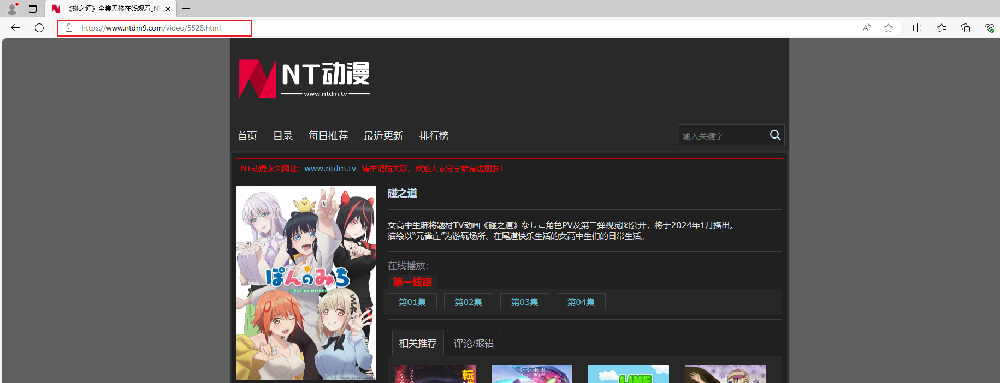

## 将 NT 动漫网站中， [某一动漫主页地址](https://www.ntdm9.com/video/5528.html) 放入anime_homepage.txt中，启动 download_anime.py 即可下载该动漫的每一集，并保存到指定目录

## github 项目文件地址：<https://github.com/vikingsword/Network/tree/master/spider/tools/anime/all_anime_download>
## todo :
### 1. 下载超时重试
### 2. 下载进度条
### 3. mangodb 保存下载地址
### 4. 多线程下载
### 5. 添加定时任务
